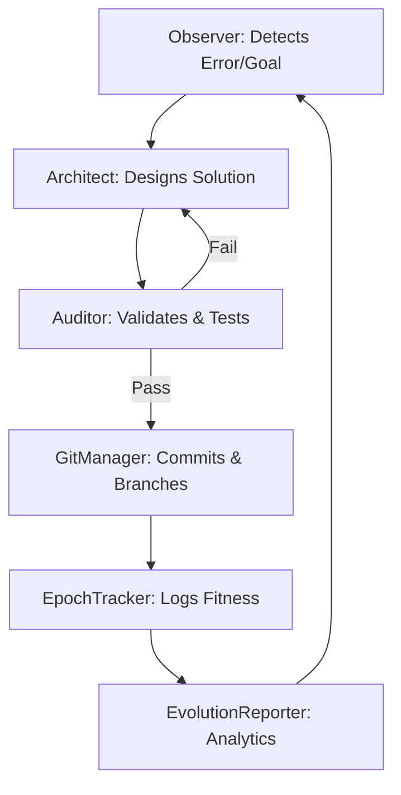

# 🧬 Evolution Agent: The Self-Actualizing Codebase

> "The first step toward true AGI is a system that can reason about, repair, and expand its own architecture."

Evolution Agent is a **Self-Coding / Self-Evolving meta-framework** built upon the [AGI-Corporation/ralph](https://github.com/AGI-Corporation/ralph) operative core. It transforms a static repository into a living organism that autonomously monitors its own health, patches vulnerabilities, and implements new features through a high-fidelity multi-agent feedback loop.

---

## 🐝 Architecture: "The Ralph Hive"

The system operates as a decentralized hive of specialized agents, each fine-tuned for a specific stage of the developmental lifecycle.

| Agent | Metaphor | Primary Mission |
| :--- | :--- | :--- |
| **Observer** | 👁️ The Senses | Scans `logs/system.log` and metrics to detect anomalies or "evolutionary opportunities." |
| **Architect** | 🧠 The Brain | Analyzes source code and context to design high-level patches and feature implementations. |
| **Auditor** | 🛡️ The Immune System | Validates logic, checks syntax, and enforces security guardrails before any code is applied. |
| **Planner** | 🚀 The Growth Engine | Deconstructs `feature_queue.json` into actionable development sprints for the hive. |

A **Supervisor** orchestrates the global loop, managing state persistence via **GitManager** and cross-agent telemetry through the **NANDABridge**.

---

## 🧬 Core Evolution Components

- **Epoch Tracker** (`evolution/epoch_tracker.py`): The system's "DNA ledger." It versions every mutation, calculates fitness scores (Success Rate × Efficiency), and maintains the "Hall of Fame" of superior agent configurations.
- **Evolution Reporter** (`evolution/reporting.py`): Generates vivid, data-driven analytics on mutation lineages, heatmaps of code changes, and performance deltas across generations.
- **NANDA Bridge** (`evolution/nanda_bridge.py`): Standardizes interoperability using the [NANDA Protocol](https://github.com/AGI-Corporation/nanda-sdk), allowing the hive to collaborate with external agents (e.g., specialized medical or security agents).

---

## 🎙️ Voice Coding Agent (The "No-Keyboard" Interface)

Step into the future of development with a voice-native interface that bridges human intent and machine execution.

### ✨ Vivid Workflow Example
1. **Initiate:** You press `Enter`.
2. **Speak:** "Add an async health-check endpoint to the main app that returns the current epoch from the tracker."
3. **Reason:** The system uses **Whisper STT** to transcribe your voice, and **GPT-4o** to architect the code.
4. **Listen:** The agent explains its plan aloud via **OpenAI TTS**: *"I am adding a `/health` route to main_app.py that queries the EpochTracker for the latest state."*
5. **Execute:** The code is generated, displayed, and saved to your project.

---

## 🛠️ How It Works: The Continuous Loop



---

## 📂 Project Anatomy

```text
evolution-agent/
├── evolution/             # The "Prefrontal Cortex"
│   ├── agents.py          # Logic for Observer, Architect, Auditor, Planner
│   ├── engine.py          # The heartbeat of the evolution loop
│   ├── epoch_tracker.py   # Fitness scoring and lineage tracking
│   ├── nanda_bridge.py    # Cross-agent interoperability layer
│   └── sandbox.py         # Secure execution environment for testing
├── logs/                  # System sensory data
├── main_app.py            # The target organism (being evolved)
└── voice_agent.py         # The voice-interactive gateway
```

---

## 🚀 Quick Start: Ignite the Hive

### 1. Environmental Setup
```bash
pip install -r requirements.txt
export OPENAI_API_KEY="your-key-here"
```

### 2. Launch the Voice Agent
```bash
python voice_agent.py --seconds 15
```

### 3. Start Autonomously
```bash
# Force the system to refactor itself for performance
python -m cli.evolve --task "Optimize loop latency in engine.py" --pop_size 8
```

---

## 🛡️ Safety & Integrity

- **Atomic Commits:** Every evolution occurs on an isolated `fix/` or `feat/` branch.
- **Automated Rollback:** If a mutation fails runtime tests, the system triggers an immediate `git reset --hard` to the last known-good state.
- **Sandboxed Validation:** No code touches the `main` branch without passing the Auditor's automated test suite.

---

Maintained by **AGI Corporation** — *Pioneers in Self-Evolving Agentic Infrastructure.*
